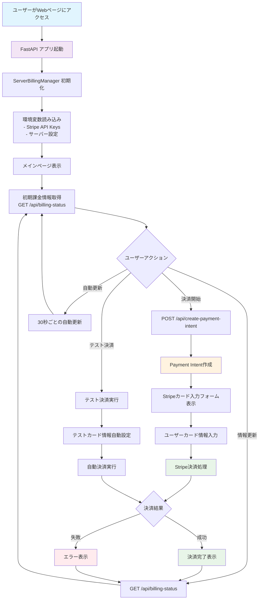
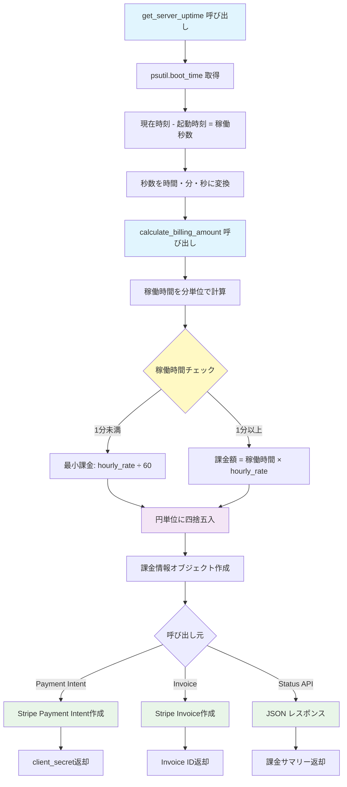
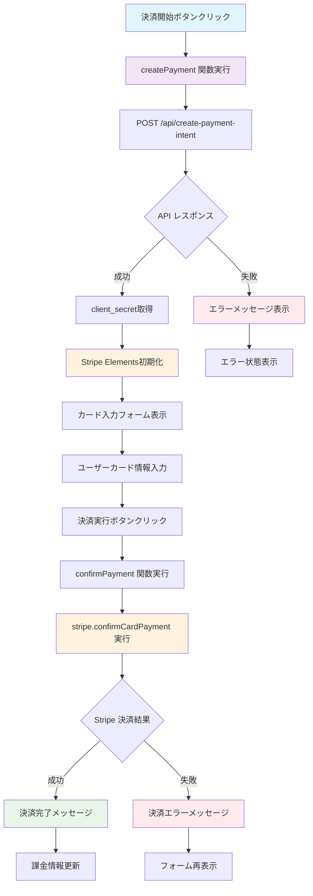
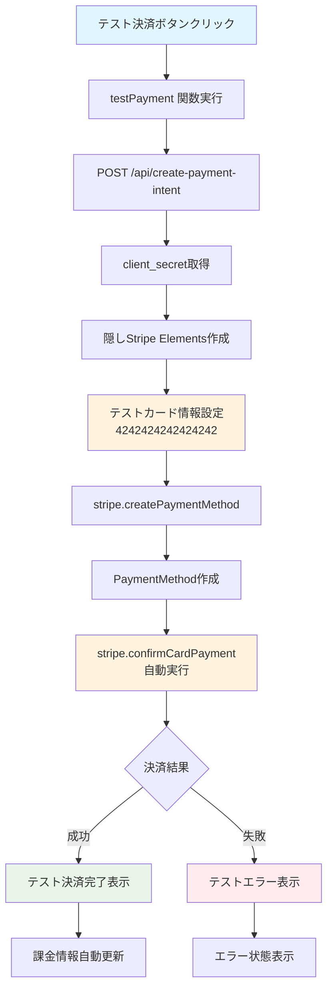

# サーバー課金システム (Server Billing System)

サーバーの稼働時間に応じてStripeで自動課金を行うPythonアプリケーションです。

## 🚀 機能

- **リアルタイム稼働時間監視**: psutilを使用してサーバーの正確な稼働時間を取得
- **自動課金計算**: 稼働時間 × 時間単価で課金額を自動計算
- **Stripe決済連携**: Payment IntentやInvoiceを使用した柔軟な決済オプション
- **Webダッシュボード**: FastAPIベースのWebインターフェース
- **リアルタイム更新**: 30秒ごとに課金情報を自動更新

## 📁 ファイル構成

```
stripe-python/
├── requirements.txt        # 依存関係
├── .env                   # 環境変数設定
├── .env.example          # 環境変数テンプレート
├── server_billing.py     # メイン課金ロジック
├── web_app.py            # FastAPI Webアプリ
└── README.md             # このファイル
```

## ⚙️ セットアップ

### 1. 依存関係のインストール

```bash
pip install -r requirements.txt
```

### 2. Stripe設定

#### 2.1 Stripeアカウント作成
1. [Stripe公式サイト](https://stripe.com/jp)でアカウントを作成
2. ダッシュボードにログイン

#### 2.2 APIキー取得
1. Stripeダッシュボードで「開発者」→「APIキー」にアクセス
2. テスト環境のキーをコピー：
   - **Publishable key** (pk_test_で始まる)
   - **Secret key** (sk_test_で始まる)

#### 2.3 Webhook設定（オプション）
1. 「開発者」→「Webhook」→「エンドポイントを追加」
2. エンドポイントURL: `https://yourdomain.com/webhooks/stripe`
3. イベント選択: `payment_intent.succeeded`, `invoice.payment_succeeded`
4. Webhook署名シークレットをコピー


Other 5. ローカル開発環境では、Stripe CLIを使用してWebhookイベントを転送することも可能

```bash
stripe listen --forward-to localhost:8000/webhooks/stripe
```
### 2.3 Stripe CLIのインストール（ローカル開発用）
Stripe CLIを使用してローカルでWebhookイベントをテストできます。
1. [Stripe CLIのインストールガイド](https://stripe.com/docs/stripe-cli#install)に従ってインストール
2. インストール後、以下のコマンドでログインします：

```bash
stripe login
```
3. 
```
stripe listen --forward-to localhost:8000/webhooks/stripe
```
でローカルサーバーにWebhookイベントを転送


### 2.4 環境変数設定

`.env.example`をコピーして`.env`を作成し、以下の内容を入力：

```bash

### 3. 環境変数設定

`.env`ファイルを編集してStripe設定を追加：

```bash
# Stripe Configuration
STRIPE_SECRET_KEY=sk_test_your_actual_secret_key_here
STRIPE_PUBLISHABLE_KEY=pk_test_your_actual_publishable_key_here
STRIPE_WEBHOOK_SECRET=whsec_your_webhook_secret_here

# Server Configuration
SERVER_NAME=MyAwesomeServer
HOURLY_RATE=100
CURRENCY=jpy

# Application Settings
DEBUG=True
PORT=8000
```

## 🔧 使用方法

### 基本的な課金システム実行

```bash
python server_billing.py
```

### Webアプリケーション起動

```bash
python web_app.py
```

ブラウザで `http://localhost:8000` にアクセス

### API利用例

#### 課金状況取得
```bash
curl http://localhost:8000/api/billing-status
```

#### Payment Intent作成
```bash
curl -X POST http://localhost:8000/api/create-payment-intent \
  -H "Content-Type: application/json"
```

#### 稼働時間取得
```bash
curl http://localhost:8000/api/uptime
```

## 🎯 Stripeダッシュボード設定手順

### 1. テスト環境での確認

1. **ダッシュボード概要**
   - 「テストデータを表示」がオンになっていることを確認
   - 支払い、顧客、商品のセクションで取引を監視

2. **テスト用カード情報**
   - カード番号: `4242424242424242`
   - 有効期限: 任意の将来日付
   - CVC: 任意の3桁

### 2. 商品・価格設定（オプション）

1. **商品作成**
   - 「商品」→「商品を追加」
   - 商品名: "サーバー利用料金"
   - 説明: "時間単位でのサーバー利用料金"

2. **価格設定**
   - 料金モデル: 「一度限り」または「定期」
   - 価格: 時間単価に応じて設定
   - 通貨: JPY

### 3. 顧客管理

1. **顧客登録**
   - 「顧客」→「顧客を追加」
   - 必要な顧客情報を入力

   例: 
    - 名前: 山田 太郎
    - メール: 

2. **支払い方法**
   - 顧客の支払い方法を事前登録可能

### 4. イベント監視

1. **ログ確認**
   - 「開発者」→「ログ」で全APIリクエストを確認
   - エラーやトラブルシューティングに活用

2. **イベント確認**
   - 「開発者」→「イベント」で Webhook イベントを確認

## 💡 カスタマイズ

### 課金レート変更
`.env`ファイルの`HOURLY_RATE`を変更

### 通貨変更
`.env`ファイルの`CURRENCY`を変更（usd, eur, jpy等）

### 最小課金単位変更
`server_billing.py`の`calculate_billing_amount`メソッドを編集

## 🔒 セキュリティ注意事項

1. **Secret Keyの保護**
   - `.env`ファイルをgitリポジトリにコミットしない
   - 本番環境では環境変数を使用

2. **Webhook検証**
   - 本番環境ではWebhook署名の検証を実装

3. **HTTPS使用**
   - 本番環境では必ずHTTPSを使用

## 🐛 トラブルシューティング

### よくあるエラー

1. **Stripe API Key エラー**
   ```
   stripe.error.AuthenticationError
   ```
   → `.env`ファイルのAPIキーを確認

2. **金額エラー**
   ```
   Amount must be at least ¥1
   ```
   → 最小課金額（1円）未満の場合のエラー

3. **ネットワークエラー**
   ```
   ConnectionError
   ```
   → インターネット接続とStripeサービス状況を確認

### ログ確認方法

```bash
# デバッグモードで実行
DEBUG=True python server_billing.py
```

## 📊 監視・分析

### Stripeダッシュボードでの分析

1. **売上分析**
   - 日別・月別の売上推移
   - 顧客別利用状況

2. **失敗分析**
   - 決済失敗率
   - エラー原因分析

## 🚀 本番環境デプロイ

1. **環境変数設定**
   ```bash
   export STRIPE_SECRET_KEY=sk_live_...
   export STRIPE_PUBLISHABLE_KEY=pk_live_...
   ```

2. **HTTPS設定**
   - SSL証明書の設定
   - リバースプロキシ（nginx等）の設定

3. **監視設定**
   - サーバー監視
   - ログ監視
   - アラート設定

## 📞 サポート

- Stripe公式ドキュメント: https://stripe.com/docs
- Stripe日本語サポート: https://support.stripe.com/

---

## 📖 web_app.py の詳細解説

### 概要
`web_app.py`は、FastAPIを使用してサーバー課金システムのWebインターフェースを提供するメインアプリケーションです。このファイルには、Webアプリケーションのフロントエンドとバックエンドの両方の機能が含まれています。

### 主要コンポーネント

#### 1. **FastAPIアプリケーション設定**
```python
app = FastAPI(title="Server Billing System", version="1.0.0")
billing_manager = ServerBillingManager()
```
- FastAPIインスタンスを作成
- `ServerBillingManager`クラスのインスタンスを生成してStripe決済と課金計算を管理

#### 2. **メインページエンドポイント (`/`)**
- HTMLコンテンツを動的に生成して返す
- Stripe JavaScript SDK を統合
- リアルタイムでの課金情報表示
- 決済フォームとカード入力UI

#### 3. **APIエンドポイント**

##### `/api/create-payment-intent` (POST)
- Stripe Payment Intentを作成
- 現在の稼働時間に基づいて課金額を計算
- クライアント側でカード決済を処理するためのclient_secretを返す

##### `/api/billing-status` (GET)
- 現在の課金状況をJSON形式で返す
- サーバー名、稼働時間、時間単価、合計金額を含む

##### `/api/uptime` (GET)  
- サーバーの稼働時間のみを返す

### フロントエンド機能

#### 1. **Stripe Elements統合**
- セキュアなカード入力フィールド
- PCI DSS準拠のカード情報処理

#### 2. **リアルタイム更新**
- 30秒ごとに課金情報を自動更新
- 非同期JavaScript（fetch API）を使用

#### 3. **決済フロー**
- **通常決済**: ユーザーがカード情報を入力
- **テスト決済**: テスト用カード番号を自動使用

### セキュリティ機能
- Stripe Elements による安全なカード情報処理
- クライアント側でのPCI DSS準拠
- Payment Intentによる二段階決済認証

## 🔄 アプリケーションフローチャート

### 全体のシステムフロー



### 課金計算フロー（ServerBillingManager）



### 決済処理フロー（フロントエンド）



### テスト決済専用フロー



## 📋 初心者向け解説

### web_app.py の理解ポイント

#### 1. **FastAPI とは？**
- Python用の高速なWebフレームワーク
- 自動的にAPIドキュメントを生成
- 非同期処理をサポート

#### 2. **Stripe Integration の仕組み**
- **Payment Intent**: 決済の「意図」を表すオブジェクト
- **Client Secret**: フロントエンドで決済を完了するためのキー
- **Elements**: セキュアなカード入力UI

#### 3. **フロントエンドとバックエンドの連携**
- **バックエンド（Python）**: 課金計算、Stripe API呼び出し
- **フロントエンド（JavaScript）**: ユーザーインターフェース、カード入力

#### 4. **セキュリティの考慮点**
- カード情報は直接サーバーに送信されない
- Stripe Elementsが安全に処理
- PCI DSS準拠の実装

#### 5. **エラーハンドリング**
- 各API呼び出しでtry-catch処理
- ユーザーにわかりやすいエラーメッセージ
- 決済失敗時の適切な処理

### 開発時の注意点

#### 1. **環境変数管理**
```bash
# 必須の環境変数
STRIPE_SECRET_KEY=sk_test_...    # サーバーサイド用
STRIPE_PUBLISHABLE_KEY=pk_test_...  # クライアントサイド用
```

#### 2. **テスト用カード番号**
- `4242424242424242`: 成功パターン
- `4000000000000002`: カード拒否パターン
- `4000000000009995`: 残高不足パターン

#### 3. **本番環境への移行**
- テストキーから本番キーに変更
- HTTPS必須
- Webhook検証の実装

## 📄 ライセンス

MIT License


## 📄 ライセンス

MIT License

