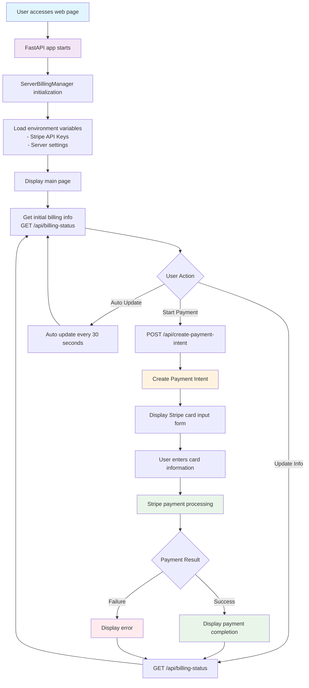
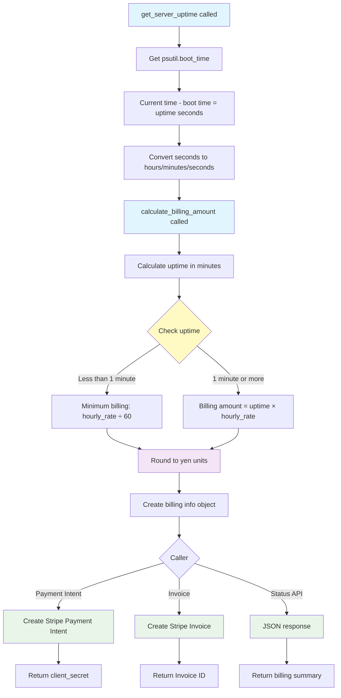
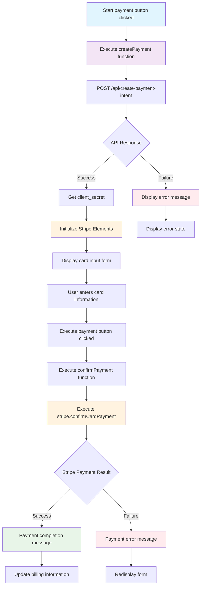

# Server Billing System

A Python application that performs automatic billing with Stripe based on server uptime.

## 🚀 Features

- **Real-time uptime monitoring**: Get accurate server uptime using psutil
- **Automatic billing calculation**: Automatically calculate billing amount based on uptime × hourly rate
- **Stripe payment integration**: Flexible payment options using Payment Intent and Invoice
- **Web dashboard**: FastAPI-based web interface
- **Real-time updates**: Automatically update billing information every 30 seconds

## 📁 File Structure

```
stripe-python/
├── requirements.txt        # Dependencies
├── .env                   # Environment variables
├── .env.example          # Environment variables template
├── server_billing.py     # Main billing logic
├── web_app.py            # FastAPI Web application
└── README.md             # This file
```

## ⚙️ Setup

### 1. Install Dependencies

```bash
pip install -r requirements.txt
```

### 2. Stripe Configuration

#### 2.1 Create Stripe Account
1. Create an account on [Stripe official website](https://stripe.com)
2. Log in to the dashboard

#### 2.2 Get API Keys
1. Access "Developers" → "API keys" in the Stripe dashboard
2. Copy test environment keys:
   - **Publishable key** (starts with pk_test_)
   - **Secret key** (starts with sk_test_)

#### 2.3 Webhook Setup (Optional)
1. "Developers" → "Webhooks" → "Add endpoint"
2. Endpoint URL: `https://yourdomain.com/webhooks/stripe`
3. Select events: `payment_intent.succeeded`, `invoice.payment_succeeded`
4. Copy webhook signing secret

### 2.4 Stripe CLI Installation (For Local Development)
You can test webhook events locally using Stripe CLI.
1. Follow the [Stripe CLI installation guide](https://stripe.com/docs/stripe-cli#install)
2. After installation, log in with the following command:

```bash
stripe login
```

3. Forward webhook events to your local server:
```bash
stripe listen --forward-to localhost:8000/webhooks/stripe
```

### 3. Environment Variables Setup

Copy `.env.example` to create `.env` and enter the following content:

```bash
# Stripe Configuration
STRIPE_SECRET_KEY=sk_test_your_actual_secret_key_here
STRIPE_PUBLISHABLE_KEY=pk_test_your_actual_publishable_key_here
STRIPE_WEBHOOK_SECRET=whsec_your_webhook_secret_here

# Server Configuration
SERVER_NAME=MyAwesomeServer
HOURLY_RATE=100
CURRENCY=jpy

# Application Settings
DEBUG=True
PORT=8000
```

## 🔧 Usage

### Basic Billing System Execution

```bash
python server_billing.py
```

### Start Web Application

```bash
python web_app.py
```

Access `http://localhost:8000` in your browser

### API Usage Examples

#### Get Billing Status
```bash
curl http://localhost:8000/api/billing-status
```

#### Create Payment Intent
```bash
curl -X POST http://localhost:8000/api/create-payment-intent \
  -H "Content-Type: application/json"
```

#### Get Uptime
```bash
curl http://localhost:8000/api/uptime
```

## 🎯 Stripe Dashboard Setup Instructions

### 1. Test Environment Verification

1. **Dashboard Overview**
   - Confirm that "View test data" is enabled
   - Monitor transactions in payments, customers, and products sections

2. **Test Card Information**
   - Card number: `4242424242424242`
   - Expiration date: Any future date
   - CVC: Any 3 digits

### 2. Product/Price Setup (Optional)

1. **Create Product**
   - "Products" → "Add product"
   - Product name: "Server Usage Fee"
   - Description: "Hourly server usage fee"

2. **Price Setting**
   - Pricing model: "One-time" or "Recurring"
   - Price: Set according to hourly rate
   - Currency: JPY

### 3. Customer Management

1. **Customer Registration**
   - "Customers" → "Add customer"
   - Enter required customer information

   Example:
   - Name: John Doe
   - Email: john@example.com

2. **Payment Methods**
   - Customer payment methods can be pre-registered

### 4. Event Monitoring

1. **Log Verification**
   - Check all API requests in "Developers" → "Logs"
   - Use for error and troubleshooting

2. **Event Verification**
   - Check webhook events in "Developers" → "Events"

## 💡 Customization

### Change Billing Rate
Change `HOURLY_RATE` in the `.env` file

### Change Currency
Change `CURRENCY` in the `.env` file (usd, eur, jpy, etc.)

### Change Minimum Billing Unit
Edit the `calculate_billing_amount` method in `server_billing.py`

## 🔒 Security Considerations

1. **Protect Secret Key**
   - Do not commit `.env` file to git repository
   - Use environment variables in production

2. **Webhook Verification**
   - Implement webhook signature verification in production

3. **Use HTTPS**
   - Always use HTTPS in production environment

## 🐛 Troubleshooting

### Common Errors

1. **Stripe API Key Error**
   ```
   stripe.error.AuthenticationError
   ```
   → Check API keys in `.env` file

2. **Amount Error**
   ```
   Amount must be at least ¥1
   ```
   → Error when below minimum billing amount (1 yen)

3. **Network Error**
   ```
   ConnectionError
   ```
   → Check internet connection and Stripe service status

### How to Check Logs

```bash
# Run in debug mode
DEBUG=True python server_billing.py
```

## 📊 Monitoring & Analytics

### Analytics in Stripe Dashboard

1. **Revenue Analysis**
   - Daily/monthly revenue trends
   - Customer usage patterns

2. **Failure Analysis**
   - Payment failure rates
   - Error cause analysis

## 🚀 Production Environment Deployment

1. **Environment Variable Setup**
   ```bash
   export STRIPE_SECRET_KEY=sk_live_...
   export STRIPE_PUBLISHABLE_KEY=pk_live_...
   ```

2. **HTTPS Setup**
   - SSL certificate configuration
   - Reverse proxy (nginx, etc.) configuration

3. **Monitoring Setup**
   - Server monitoring
   - Log monitoring
   - Alert configuration

## 📞 Support

- Stripe Official Documentation: https://stripe.com/docs
- Stripe Support: https://support.stripe.com/

---

## 📖 Detailed Explanation of web_app.py

### Overview
`web_app.py` is the main application that provides a web interface for the server billing system using FastAPI. This file contains both frontend and backend functionality for the web application.

### Main Components

#### 1. **FastAPI Application Setup**
```python
app = FastAPI(title="Server Billing System", version="1.0.0")
billing_manager = ServerBillingManager()
```
- Create FastAPI instance
- Generate `ServerBillingManager` class instance to manage Stripe payments and billing calculations

#### 2. **Main Page Endpoint (`/`)**
- Dynamically generate and return HTML content
- Integrate Stripe JavaScript SDK
- Real-time billing information display
- Payment form and card input UI

#### 3. **API Endpoints**

##### `/api/create-payment-intent` (POST)
- Create Stripe Payment Intent
- Calculate billing amount based on current uptime
- Return client_secret for processing card payments on client side

##### `/api/billing-status` (GET)
- Return current billing status in JSON format
- Include server name, uptime, hourly rate, and total amount

##### `/api/uptime` (GET)
- Return server uptime only

### Frontend Features

#### 1. **Stripe Elements Integration**
- Secure card input fields
- PCI DSS compliant card information processing

#### 2. **Real-time Updates**
- Automatically update billing information every 30 seconds
- Use asynchronous JavaScript (fetch API)

#### 3. **Payment Flow**
- **Regular Payment**: User enters card information

### Security Features
- Secure card information processing with Stripe Elements
- PCI DSS compliance on client side
- Two-step payment authentication with Payment Intent

## 🔄 Application Flow Chart

### Overall System Flow



### Billing Calculation Flow (ServerBillingManager)



### Payment Processing Flow (Frontend)




## 📋 Beginner's Guide

### Understanding web_app.py

#### 1. **What is FastAPI?**
- High-performance web framework for Python
- Automatically generates API documentation
- Supports asynchronous processing

#### 2. **How Stripe Integration Works**
- **Payment Intent**: Object representing payment "intent"
- **Client Secret**: Key for completing payment on frontend
- **Elements**: Secure card input UI

#### 3. **Frontend and Backend Coordination**
- **Backend (Python)**: Billing calculations, Stripe API calls
- **Frontend (JavaScript)**: User interface, card input

#### 4. **Security Considerations**
- Card information is not sent directly to server
- Stripe Elements handles securely
- PCI DSS compliant implementation

#### 5. **Error Handling**
- Try-catch processing for each API call
- User-friendly error messages
- Proper handling of payment failures

### Development Considerations

#### 1. **Environment Variable Management**
```bash
# Required environment variables
STRIPE_SECRET_KEY=sk_test_...    # For server side
STRIPE_PUBLISHABLE_KEY=pk_test_...  # For client side
```

#### 2. **Test Card Numbers**
- `4242424242424242`: Success pattern
- `4000000000000002`: Card declined pattern
- `4000000000009995`: Insufficient funds pattern

#### 3. **Production Environment Migration**
- Change from test keys to live keys
- HTTPS required
- Implement webhook verification

## 📄 License

MIT License
